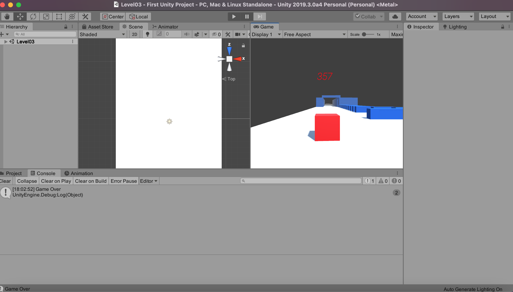
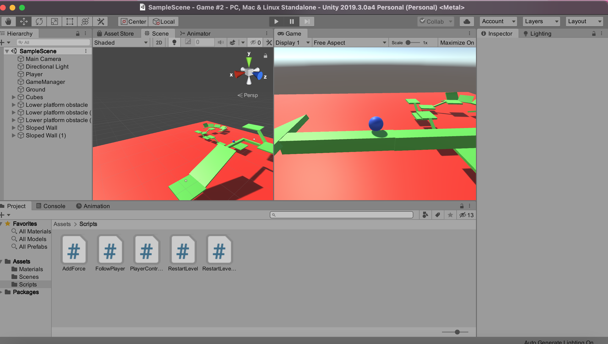

# Old-Unity-Projects
I stumbled accross these games before wiping an old laptop. 
A few experiments with C# and Unity back in early 2019. Games are poorly named.

**First Unity Project** is basically temple run, but you're a cube, and you can only go forward. I was 
pretty stoked to build it, even though it was super simple. I think I mostly followed youtube videos and coppied
someone super closely. 

**Game #2** Was my attempt to do something without following step by step instructions. It
is a balancing game where you're trying to get from point A to point B without falling off the map. 

